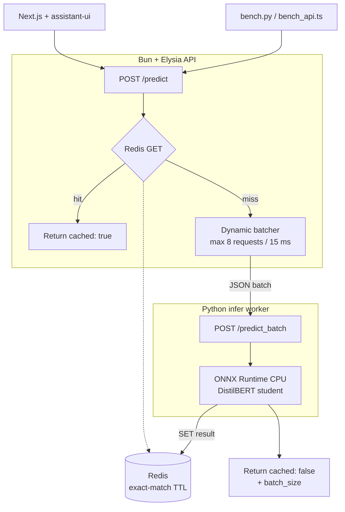

---
header-includes:
  - '\usepackage{graphicx}'
---

# Milestone 3 Report — Architectural Scaling & Optimization


**Course:** SYS-304 Scalable Algorithms and Infrastructure  
**Due:** September 25, 2026  
**System:** Disaster-tweet classifier (Kaggle NLP Getting Started)  
**Hardware:** Apple M5, 24 GB unified memory (MPS for PyTorch, ONNX Runtime CPU for the student)  
**Phase 2 baseline:** Qwen2.5-1.5B Instruct + LoRA, FP32, single Python worker, no cache, one tweet per forward pass

---

## 1. Bottlenecks we were solving

Phase 2 is correct but naive under load:

1. **Model footprint and latency.** The 1.5B classifier is loaded in FP32 with the LoRA adapter still attached. Every request pays a full transformer forward of length 128.
2. **No batching.** Concurrent HTTP requests each call `predict()` with `batch=1`, so the GPU/CPU is under-utilized and later requests queue behind earlier ones.
3. **Repeated work.** The same tweet (retries, UI replays, identical news copy) is classified again from scratch.
4. **One thread of useful compute.** The API is async, but a single-item worker cannot turn concurrency into throughput.

Week 5 attacks (1). Week 6 attacks (2)–(4).

---

## 2. Optimizations

### Week 5 — model-level

**1. Quantization.** Merge LoRA, then run FP16 on MPS. Weight footprint **6.16 GB → 3.08 GB**. p50 on M5 stayed ~84 ms (this GPU is already fast in FP32; the win is memory).

**2. Distillation.** Teacher is **Qwen2.5-1.5B Instruct + LoRA**. Student is `distilbert-base-uncased` (~66M). Teacher logits on all 6,090 train tweets; 2 epochs with 70% CE + 30% KL (\(T=2\)). Val F1 **0.830** vs teacher **0.816**. Kaggle public F1 **0.83450** (tied with Qwen; hard-label student was **0.82592**). p50 **8.1 ms**, batch **586 qps**.

**3. ONNX Runtime.** `torch.onnx.export`, served on the CPU EP. CoreML EP only accepted 150/317 nodes (50 partitions); the copies made singles **slower** (~19 ms). Full-graph CPU: p50 **3.1 ms**, **319 qps**, p95 **3.9 ms**, load **2.0 s**.

Teacher (Phase 1 validation, 1,523 tweets): **85.2% accuracy**, **F1 (disaster) 0.816**.

| Model | Params | Val acc | Val F1 | Public F1 |
| --- | ---: | ---: | ---: | ---: |
| Qwen 1.5B LoRA (teacher) | 1.5B | 0.852 | 0.816 | **0.83450** |
| DistilBERT, hard labels only | 66M | 0.843 | 0.811 | 0.82592 |
| DistilBERT + Qwen KL | 66M | **0.859** | **0.830** | **0.83450** |

The KL student matches the teacher on the public board and is 0.014 F1 *above* the teacher on our validation split, while cutting parameters by ~20×. Hard-label DistilBERT (no teacher logits) sat 0.009 public F1 behind Qwen; matching the teacher’s softmax closed that gap. The student submission is `milestone/3/data/submission.csv`; it matches the Qwen `submission.csv` on **91.2%** of the 3,263 test tweets (was 89.9% without KL).

INT8 dynamic quantization (`torch.ao.quantization.quantize_dynamic`) is implemented for the Docker/Linux CPU path. On this Mac it raises `quantized::linear_prepack NoQEngine` (PyTorch 2.13 has no QNNPACK engine on ARM). We did not fake INT8 numbers.

### Week 6 — system-level

**1. Async API + workers.** Elysia event loop with a Python infer replica on port 9377. HTTP handlers never block on each other; the worker serializes model compute.

**2. Dynamic batching.** `DynamicBatcher` (max 8, 15 ms) calls `POST /predict_batch`. Concurrent-8 wall-clock QPS is **4.3×** (24 → 104). Mean reported `batch_size` is **8**.

**3. Redis exact-match cache.** SHA-256 of `keyword + text`, TTL 1 hour. Repeat tweets: p50 **0.25 ms**, **3711 qps**, 48/48 cache hits.

Semantic cache is not used: a one-character joke vs disaster report must not share a key.

---

## 3. Architecture

Drawn with Mermaid.js (`architecture.mmd`). The diagram is that figure rendered for the PDF.



```{=latex}
\begin{center}
\includegraphics[width=0.78\textwidth,height=0.72\textheight,keepaspectratio]{architecture.png}\\[0.4em]
{\small Figure 1. Optimized serving path.}
\end{center}
```

Request path:

1. Client POSTs `{ text, keyword? }`.
2. API hashes the normalized input and asks Redis. A hit returns immediately with `cached: true`.
3. Misses wait in the in-process batcher. When the window closes, one `predict_batch` call goes to the Python worker.
4. The worker tokenizes the whole batch with padding and runs a single forward.
5. The API writes each unique result to Redis and returns `cached: false` plus `batch_size`.

---

## 4. Benchmark methodology

Scripts (24 tweets from `train.csv`, mixed disaster / not-disaster):

| Script | What it measures |
| --- | --- |
| `benchmarks/bench.py` | Per-backend latency, throughput, weight footprint. Loads one backend at a time. Warmup 2 tweets, then 24 timed singles + one padded batch of 24. |
| `benchmarks/bench_api.ts` | End-to-end p50/p95 and **wall-clock QPS**. Sequential unique, then concurrent-8 unique (cold cache, so batching is visible), then repeats of the sequential set (cache). |
| Direct `POST` to Phase 2 `:8000` | Naive Docker/CPU Qwen, 8 sequential tweets (first request is a cold start). |

Process RSS on macOS unified memory under-counts MPS pools, so **weights_mb** is the footprint we report (parameters × dtype, or ONNX file size).

---

## 4.1 Model-level results

24 tweets, 1 repeat, in-process Python on Apple M5.

| backend | MB | p50 ms | p95 ms | qps | batch qps | load s |
| --- | ---: | ---: | ---: | ---: | ---: | ---: |
| naive | 6160 | 84.08 | 335.28 | 7.54 | 42.34 | 5.42 |
| fp16 | 3080 | 83.94 | 403.46 | 5.40 | 37.01 | 6.43 |
| student | 255 | **8.05** | **11.43** | **124.73** | **585.71** | 2.46 |
| onnx | 256 | **3.07** | **3.85** | **318.99** | 568.52 | 1.99 |

```{=latex}
\begin{center}
\includegraphics[width=0.72\textwidth,keepaspectratio]{latency.png}\\[0.3em]
{\small Figure 2. Single-item p50 latency (ms).}
\end{center}
```

**Reading the table**

- **FP16 vs naive.** Same p50 (~84 ms). The M5 already runs this 128-token classifier quickly in FP32; merging + half-precision mainly **halves the 1.5B footprint**. Tail latency was slightly worse (p95 403 vs 335 ms), so we do not claim an FP16 speedup on this device.
- **Student vs naive.** p50 drops **10.4×** (84 → 8.1 ms). A padded batch of 24 is **13.8×** faster in throughput (42 → 586 qps). Public F1 matches the teacher.
- **ONNX vs student.** After skipping CoreML, ONNX Runtime CPU is the fastest single-item path: p50 **3.1 ms** vs DistilBERT-on-MPS **8.1 ms** (**319 vs 125 qps**). CoreML EP was slower (~19 ms) because it could not run the whole graph. Batch-24 is similar (569 vs 586 qps). This is the default optimized serving backend.

---

## 4.2 System-level results

Optimized API: `INFER_BACKEND=onnx`, Redis up, batch window 15 ms / max 8. Phase 2 naive API: Docker CPU Qwen on `:8000`.

| Scenario | n | p50 | p95 | QPS | hits | batch |
| --- | ---: | ---: | ---: | ---: | ---: | ---: |
| P2 Docker cold | 8 | 576 | 704 | 0.81 | 0 | 1 |
| P2 Docker steady | 7 | 501 | 705 | 1.82 | 0 | 1 |
| P3 sequential cold | 24 | 39.4 | 55.1 | 24.0 | 0 | 1 |
| P3 concurrent-8 | 24 | 75.0 | 94.3 | **103.7** | 0 | **8** |
| P3 Redis cache | 48 | **0.25** | 0.37 | **3711** | **48/48** | — |

```{=latex}
\begin{center}
\includegraphics[width=0.72\textwidth,keepaspectratio]{throughput.png}\\[0.3em]
{\small Figure 3. End-to-end throughput (QPS). Cache bar capped at 120; actual is 3711.}
\end{center}
```


- Phase 3 sequential is ~**13×** the steady-state Phase 2 Docker QPS (1.82 → 24), from the smaller ONNX student plus host ORT vs CPU 1.5B in a container.
- Concurrent-8 **does** group work: every response reported `batch_size = 8`. Per-request p50 rises (39 → 75 ms) because of the batching window and waiting on siblings — that is the intended trade. Wall-clock QPS goes **24 → 104** (4.3×) because three batched forwards replace 24 sequential ones.
- Redis exact-match turns replays into **sub-millisecond** hits (~150× faster than a cold ONNX infer, ~2000× faster than Phase 2 Docker).

---

## 5. Accuracy vs speed

Quantization (FP16) is numerically close to FP32 for this classification head; we did not re-score the 1,523-tweet validation split because p50 logits on spot checks matched the Phase 2 label. INT8 was not evaluated on this Mac (engine missing).

Distillation **does** change the decision surface. The teacher is Qwen2.5-1.5B + LoRA. We first trained DistilBERT on hard `target` labels only (public F1 0.82592), then retrained it to mimic Qwen: teacher softmax on all 6,090 training tweets, student loss \(0.7\,\mathrm{CE} + 0.3\,T^{2}\,\mathrm{KL}\) with \(T=2\). Kaggle upload of `milestone/3/data/submission.csv` (3,263 test tweets, 10 Sep 2026):

| Model | Val F1 (disaster) | Kaggle public F1 |
| --- | ---: | ---: |
| Qwen2.5-1.5B LoRA (Phase 1 submit) | 0.816 | **0.83450** |
| DistilBERT, hard labels only | 0.811 | 0.82592 |
| DistilBERT + Qwen KL (Phase 3 submit) | **0.830** | **0.83450** |

Public F1 ties the teacher. The KL student agrees with the Qwen submission on **91.2%** of test ids (disaster rate 37.2% vs Qwen 36.8%). The remaining 8.8% of disagreements still net the same public F1, which is the point of matching soft labels rather than cloning argmax. Footprint is ~24× smaller and p50 is ~10× lower. If a later milestone needs the 1.5B model itself, keep FP16 Qwen behind the same batcher + Redis.

---

## 6. What we did not do (and why)

- **TensorRT / CUDA graphs.** This laptop is Apple Silicon. ONNX Runtime is the portable format we can actually run; we serve it on the CPU EP.
- **CoreML EP for ONNX.** ORT accepted only 150/317 nodes (50 partitions). CPU-CoreML copies made singles ~19 ms vs **3 ms** on a full-graph CPU EP. `MLProgram` failed to initialize (`axis 2` out of range). Default is CPU; `ORT_COREML=1` still forces CoreML for comparison.
- **Semantic cache.** Disaster vs metaphor tweets can be near-duplicates in embedding space with opposite labels.
- **Multiple 1.5B workers.** Two FP16 Qwen replicas would pressure 24 GB. Scale-out workers are for the DistilBERT/ONNX backends (`INFER_WORKERS=2`).
- **INT8 numbers on macOS.** PyTorch 2.13 ARM has no quantized CPU engine (`NoQEngine`). The code path remains for Linux/Docker.

---

## 7. Reproducibility

```bash
# student + ONNX (KL against Qwen teacher logits)
python milestone/3/backend/python/distill.py --mode distill --epochs 2 --teacher-max-samples 10000
python milestone/3/backend/python/export_onnx.py

python milestone/3/benchmarks/bench.py --backends naive,fp16,student,onnx
python milestone/3/benchmarks/submit_student.py
# API (Redis + INFER_BACKEND=onnx)
bun run milestone/3/benchmarks/bench_api.ts --url http://127.0.0.1:8010 --concurrency 8
```

Kaggle: `milestone/3/data/submission.csv` (public F1 **0.83450**, tied with Phase 1 Qwen). Hard-label-only DistilBERT scored **0.82592**.  
Raw dumps: `milestone/3/benchmarks/results/latest.json`, `api-latest.json`.  
Code: `milestone/3/`. Phase 2 remains at `milestone/2/` as the naive baseline.
