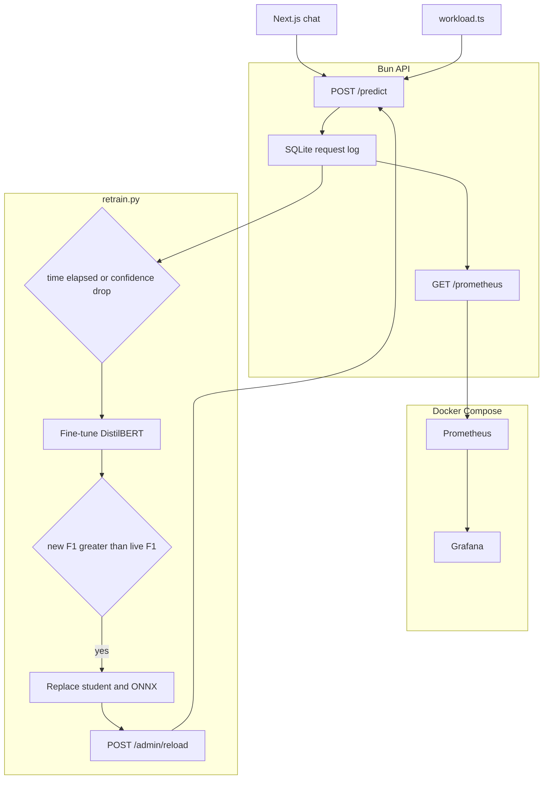

# Milestone 4 Report — Observability and Retraining

**Course:** SYS-304 Scalable Algorithms and Infrastructure  
**System:** Disaster-tweet classifier (Kaggle NLP Getting Started)  
**Stack:** Bun/Elysia API, SQLite request log, Prometheus, Grafana, DistilBERT retraining

## 1. Domain and problem

A tweet is classified as a real disaster (`1`) or not (`0`). The same words appear in news and in jokes, so the service has to stay accurate as the live mix of keywords and wording moves away from the 2016 Kaggle training set.

v1 trained Qwen2.5-1.5B with LoRA. v2 wrapped it in an API and a chat UI. v3 added quantization, a DistilBERT student, ONNX, dynamic batching, and a Redis cache. v4 answers a different question: can we see when the live traffic or the model gets worse, and can we replace the student without a manual copy?

## 2. Design decisions

**SQLite for the request log.** Prometheus stores numeric series, not the tweet text we need for drift and for a later label join. `bun:sqlite` keeps the log in `milestone/4/data/requests.sqlite` next to the API. Each `/predict` and `/chat` row stores the text, keyword, latency, HTTP status, predicted label, and confidence. `truth_target` stays null until someone supplies a ground-truth file.

**Prometheus and Grafana for the dashboard.** The API exposes `GET /prometheus`. Prometheus in Docker scrapes the host API every 5 seconds. Grafana is provisioned with one dashboard: request rate, error ratio, latency p50/p95, mean confidence, keyword total-variation distance, text-length z-score, and live predicted disaster rate against the training label rate. Grafana listens on port 3001 so it does not take the chat UI's port 3000.

**Drift is computed in the API, then exported as gauges.** The baseline is `milestone/1/data/train.csv` (length, word count, keyword shares, disaster-label rate). The live window is the last 200 successful requests. Keyword shift uses total variation distance, with keywords absent from training collapsed into `(other)`. A z-score compares live mean length with the training mean and standard deviation. Doing this at scrape time means Grafana does not need a SQL plugin, and the same numbers are what an alert would read later.

**Retraining stays a script.** `python/retrain.py` is started by hand. It runs when the time since the last cycle exceeds the interval, or when mean confidence drops under a floor. `--mean-confidence` simulates that drop so the path can be demonstrated without waiting for the model to actually get unsure. The script fine-tunes the DistilBERT student on rows that already have `truth_target`, evaluates it against the current student on a held-out 20%, and only then copies weights into the v3 model directory, exports ONNX, and restarts the infer worker with `POST /admin/reload`.

## 3. Architecture

## 4. Scaling bottlenecks and mitigations

| Bottleneck | What breaks | Mitigation already in the design | What to do next |
| --- | --- | --- | --- |
| SQLite writer | One API process is fine. Several API replicas would lock the file. | WAL and a busy timeout. One Bun process owns the file. | Move the log to PostgreSQL and keep Prometheus as the dashboard source. |
| Scrape computes drift over the log | A multi-million-row scan on every 5s scrape gets slow. | Drift uses the last 200 successes, not the full history. Counters are a single grouped query. | Maintain rolling aggregates in memory and treat SQLite as the durable copy. |
| Prometheus on one laptop | A single Prometheus disk fills, and it cannot outlive the machine. | 5s scrape is for the demo. The metrics are cheap gauges and one histogram. | Remote-write to a longer store, and raise the scrape interval in production. |
| Retrain on the API host | Fine-tuning DistilBERT on the same machine as inference competes for memory. | The script is separate from the request path. The worker restarts only after a better F1. | Run training on another machine and have it call the same reload endpoint. |
| Reload drops requests | Killing the Python worker stalls `/predict` until the new process loads. | v3 batching still queues, but a cold ONNX load is a gap of a few seconds. | Load the new model in a second worker, then switch `INFER_URL` and stop the old one. |
| Exact-match labels | Only tweets that copy the training text receive `truth_target` from `--apply-train-labels`. | The column is nullable on purpose. A later CSV of real labels uses the same update. | Add a review queue instead of exact string match. |
| Confidence is not accuracy | A confident wrong model will not trip the confidence trigger. | Time still forces a cycle. Promotion requires a higher F1 on labeled data, not a higher confidence. | Alert on drift gauges as well as confidence. |

## 5. What this does not claim

The workload generator creates obvious drift (unknown keywords, very short and very long text) so the Grafana panels move during a demo. It is not a model of a real traffic shift. The confidence flag is a simulated drop for the same reason. Promotion is gated on a small held-out slice of the labeled log, so a tiny or one-class sample can look better than it is. The minimum row count is there to refuse that case, not to replace a proper offline eval on the original validation split.
